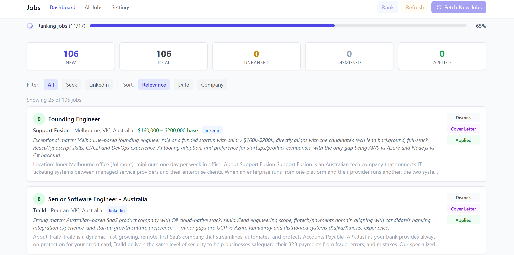

# Job Applier

A job scraping and ranking application that automatically collects listings from Seek and LinkedIn, then uses Claude AI to rank them by relevance to your profile.



## Features

- **Multi-source scraping** — Fetches jobs from Seek and LinkedIn with configurable search queries
- **AI-powered ranking** — Uses Claude CLI to score jobs 1–10 based on your profile
- **Cover letter generation** — Claude generates tailored cover letters with customizable tone
- **Search configuration** — Create and manage saved searches per source from the Settings page
- **Web dashboard** — Filter, sort, and manage jobs with a clean Tailwind CSS interface
- **Status tracking** — Mark jobs as seen, dismissed, or applied
- **Background operations** — Scraping, ranking, and refreshing run in background threads with live progress
- **Smart deduplication** — Prevents duplicate listings using composite keys per source
- **Polite scraping** — Random 2–5 second delays between requests

## Prerequisites

- Python 3.8+
- [Claude CLI](https://docs.anthropic.com/en/docs/claude-code) installed and available on your PATH

## Getting Started

### 1. Clone the repository

```bash
git clone <repo-url>
cd job-applier
```

### 2. Create a virtual environment

On Debian/Ubuntu, you may need to install the venv package first:

```bash
sudo apt install python3-venv
```

Then create and activate the environment:

```bash
python3 -m venv venv
source venv/bin/activate
```

### 3. Install dependencies

```bash
pip install -r requirements.txt
```

### 4. Configure environment variables

```bash
cp .env.example .env
```

Edit `.env` and set your secret key:

```
FLASK_SECRET_KEY=change-me-to-something-random
```

### 5. Run the application

```bash
python app.py
```

The app will be available at **http://localhost:5000**.

## Usage

1. **Set up your profile** — Go to Settings and fill in your skills, target titles, preferences, minimum salary, and experience summary
2. **Configure searches** — Add Seek/LinkedIn search queries from the Settings page
3. **Fetch jobs** — Click "Fetch New Jobs" on the dashboard to scrape from your configured searches
4. **Rank jobs** — Click "Rank" to have Claude score unranked jobs against your profile
5. **Review** — Browse jobs on the dashboard sorted by relevance, with color-coded score badges
6. **Manage** — Mark jobs as Seen, Dismiss ones you're not interested in, or mark as Applied
7. **Cover letters** — Generate a tailored cover letter for any job listing
8. **Refresh** — Re-fetch job detail pages and re-rank to get updated descriptions

## Configuration

Search queries can be managed from the Settings UI or configured as defaults in `config.py`:

- `SEEK_SEARCH_URLS` — Default Seek search URL paths
- `LINKEDIN_SEARCHES` — Default LinkedIn `{keywords, location}` search dicts
- `LINKEDIN_MAX_PAGES` — Max pagination pages per LinkedIn search (default: 3)
- `CLAUDE_MODEL` — Claude model used for ranking (default: `sonnet`)
- `CLAUDE_COVER_LETTER_MODEL` — Claude model used for cover letters (default: `opus`)

## Project Structure

```
app.py              Flask routes and app entry point
config.py           Search URLs, model settings, scrape delays
database.py         SQLite schema and queries
scraper.py          Seek + LinkedIn scraping logic
ranker.py           Claude-based job ranking
cover_letter.py     Cover letter generation
templates/          Jinja2 HTML templates
static/             CSS
```

## Tech Stack

- **Backend:** Flask, SQLite
- **Scraping:** BeautifulSoup4, requests, curl_cffi
- **Frontend:** Jinja2 templates, Tailwind CSS
- **AI:** Claude CLI (called via subprocess)
